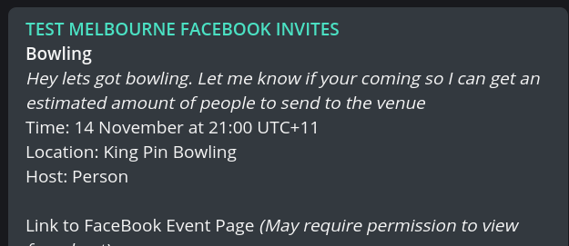
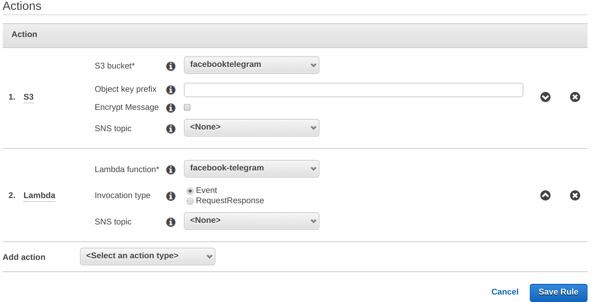

SES Lambda bot that takes emails from Facebook using SES and converts them to Telegram messages.



Install
==

1. On Telegram send `/newbot` to @botfarther and follow the prompts to create a bot
1. Invite the bot to the channel or group you want to post to.
1. Clone and build the project
```
git clone https://github.com/TheSkorm/facebook-to-telegram-bot.git
npm install
```
2. Zip up index.js and node_modules folder
3. In AWS, create a S3 bucket and a Lambda function (choose the nodejs hello world app)
4. Give the S3 bucket a bucket policy so SES can write to it
```json
{
    "Version": "2012-10-17",
    "Statement": [
        {
            "Sid": "AllowSESPuts",
            "Effect": "Allow",
            "Principal": {
                "Service": "ses.amazonaws.com"
            },
            "Action": "s3:PutObject",
            "Resource": "arn:aws:s3:::BUCKETNAMEHERE/*"
        }
    ]
}
```
5. Setup SES email receiving (verify a domain, setup MX records and create a recipient)
6. Setup SES email receiving rule set as follows: 
7. Upload the zip file to the Lambda function, set the environmental variables for 
    - `CHANNEL` : the channel shortname - eg "@channelname"
    - `TELEGRAM_API_KEY` : the API key for your telegram bot.
8. Test it by send inviting your recipient email to a facebook event.